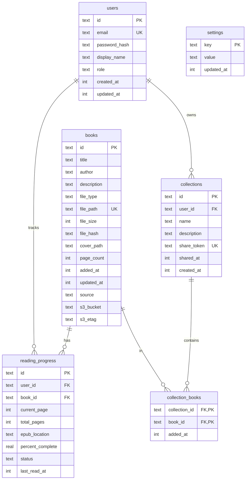

# Data Model

This document describes the database schema for Alex, including all tables, relationships, and key constraints across local-folder and S3-backed book sources.

## Entity Relationship Diagram



## Tables

### users

Stores user accounts with authentication credentials and profile information.

| Column | Type | Constraints | Description |
|--------|------|-------------|-------------|
| id | TEXT | PRIMARY KEY | UUID v4 |
| email | TEXT | NOT NULL, UNIQUE | User email address (login identifier) |
| password_hash | TEXT | NOT NULL | Bcrypt hash of password |
| display_name | TEXT | NOT NULL | User's display name (shown in UI) |
| role | TEXT | NOT NULL, DEFAULT 'user' | User role: 'admin' or 'user' |
| created_at | INTEGER | NOT NULL | Unix timestamp (seconds) |
| updated_at | INTEGER | NOT NULL | Unix timestamp (seconds) |

**Indexes:**
- Primary key on `id`
- Unique index on `email`

**Default Data:**
- System creates default admin account: `admin@localhost` / `admin123`
- Users should change default password on first login

**Roles:**
- `admin`: Can manage users, access admin panel, view all data
- `user`: Can read books, manage own collections, track own progress

---

### books

Stores book metadata and file information for all books in the library.

| Column | Type | Constraints | Description |
|--------|------|-------------|-------------|
| id | TEXT | PRIMARY KEY | UUID v4 |
| title | TEXT | NOT NULL | Book title (extracted from metadata or filename) |
| author | TEXT | NULL | Book author (if available in metadata) |
| description | TEXT | NULL | Book description/summary (if available) |
| file_type | TEXT | NOT NULL | File format: 'pdf' or 'epub' |
| file_path | TEXT | NOT NULL, UNIQUE | Local absolute path (`source='local'`) or S3 object key (`source='s3'`) |
| file_size | INTEGER | NOT NULL | File size in bytes |
| file_hash | TEXT | NOT NULL, UNIQUE | SHA-256 hash of file contents (for duplicate detection) |
| cover_path | TEXT | NULL | Absolute path to cover image (400x600 PNG) |
| page_count | INTEGER | NULL | Number of pages (PDF only) |
| added_at | INTEGER | NOT NULL | Unix timestamp when book was added |
| updated_at | INTEGER | NOT NULL | Unix timestamp of last modification |
| source | TEXT | NOT NULL, DEFAULT 'local' | Storage source: `'local'` or `'s3'` |
| s3_bucket | TEXT | NULL | Bucket name for S3-backed books; `NULL` for local books |
| s3_etag | TEXT | NULL | Last observed object ETag for S3 change detection |

**Indexes:**
- Primary key on `id`
- Unique index on `file_path` (prevents duplicate file tracking)
- Unique index on `file_hash` (prevents duplicate content)
- Index on `title` (for search performance)
- Index on `author` (for search performance)

**Cascade Behavior:**
- When a book is deleted, all associated `reading_progress` and `collection_books` records are automatically deleted (ON DELETE CASCADE)

**Notes:**
- `page_count` is NULL for EPUBs (reflowable format, no fixed pages)
- `cover_path` is NULL if cover generation failed
- `file_hash` allows different files with same content to be deduplicated
- `source='local'` rows are ingested from `LIBRARY_PATH`; `source='s3'` rows are ingested by S3 polling
- `s3_etag` is used for cheap S3 change detection before full reprocessing

---

### reading_progress

Tracks each user's reading progress for each book. One record per user-book combination.

| Column | Type | Constraints | Description |
|--------|------|-------------|-------------|
| id | TEXT | PRIMARY KEY | UUID v4 |
| user_id | TEXT | NOT NULL, FK → users.id | User who is reading the book |
| book_id | TEXT | NOT NULL, FK → books.id | Book being read |
| current_page | INTEGER | NOT NULL, DEFAULT 0 | Current page number (PDF only) |
| total_pages | INTEGER | NULL | Total pages (PDF only, cached from books.page_count) |
| epub_location | TEXT | NULL | EPUB CFI location string (EPUB only) |
| percent_complete | REAL | NOT NULL, DEFAULT 0 | Percentage read (0.0 to 100.0) |
| status | TEXT | NOT NULL, DEFAULT 'not_started' | Reading status |
| last_read_at | INTEGER | NULL | Unix timestamp of last page/location update |

**Indexes:**
- Primary key on `id`
- Composite index on `(user_id, book_id)` for fast lookups
- Index on `user_id` (for user's reading list)
- Index on `status` (for filtering by status)

**Foreign Keys:**
- `user_id` references `users.id`
- `book_id` references `books.id` with ON DELETE CASCADE

**Status Values:**
- `not_started`: Book never opened (0% progress)
- `reading`: Book in progress (0% < progress < 100%)
- `completed`: Book finished (progress = 100%)

**Format-specific Fields:**
- PDF: Uses `current_page`, `total_pages`, ignores `epub_location`
- EPUB: Uses `epub_location` (CFI string), ignores `current_page`/`total_pages`
- Both formats use `percent_complete` for progress tracking

**Automatic Updates:**
- Status automatically transitions based on `percent_complete`:
  - `percent_complete = 0` → `not_started`
  - `0 < percent_complete < 100` → `reading`
  - `percent_complete = 100` → `completed`

---

### collections

User-created collections for organizing books (e.g., "Favorites", "To Read", "Sci-Fi").

| Column | Type | Constraints | Description |
|--------|------|-------------|-------------|
| id | TEXT | PRIMARY KEY | UUID v4 |
| user_id | TEXT | NOT NULL, FK → users.id | User who owns this collection |
| name | TEXT | NOT NULL | Collection name |
| description | TEXT | NULL | Optional description |
| share_token | TEXT | UNIQUE, NULL | UUID v4 share token (null = private) |
| shared_at | INTEGER | NULL | Unix timestamp when sharing was enabled |
| created_at | INTEGER | NOT NULL | Unix timestamp |

**Indexes:**
- Primary key on `id`
- Unique index on `share_token` (for public URL lookups)
- Index on `user_id` (for listing user's collections)

**Foreign Keys:**
- `user_id` references `users.id`

**Notes:**
- Collections are user-specific (owned by one user)
- No constraint on duplicate names per user (intentional)
- `share_token` is `null` by default (collection is private)
- Setting `share_token` to a UUID v4 value makes the collection publicly viewable at `/shared/<token>`
- Revoking sharing sets `share_token` back to `null`, invalidating any existing links
- Re-sharing generates a new token (old URLs stop working)

---

### collection_books

Many-to-many relationship table linking collections to books.

| Column | Type | Constraints | Description |
|--------|------|-------------|-------------|
| collection_id | TEXT | NOT NULL, FK → collections.id, PK | Collection containing the book |
| book_id | TEXT | NOT NULL, FK → books.id, PK | Book in the collection |
| added_at | INTEGER | NOT NULL | Unix timestamp when book was added to collection |

**Indexes:**
- Composite primary key on `(collection_id, book_id)`
- Index on `collection_id` (for listing books in collection)
- Index on `book_id` (for finding collections containing a book)

**Foreign Keys:**
- `collection_id` references `collections.id`
- `book_id` references `books.id` with ON DELETE CASCADE

**Notes:**
- A book can be in multiple collections
- A collection can contain multiple books
- Deleting a book removes it from all collections (cascade)
- Deleting a collection removes all its associations

---

### settings

Key-value store for application-level settings and configuration.

| Column | Type | Constraints | Description |
|--------|------|-------------|-------------|
| key | TEXT | PRIMARY KEY | Setting identifier |
| value | TEXT | NOT NULL | Setting value (stored as string) |
| updated_at | INTEGER | NOT NULL | Unix timestamp of last update |

**Indexes:**
- Primary key on `key`

**Current Settings:**

| Key | Value | Description |
|-----|-------|-------------|
| library_version | Unix timestamp | Incremented whenever books are added/changed/deleted. Used by SSE endpoint to detect library updates. |

**Notes:**
- Settings are application-global (not user-specific)
- Values are stored as TEXT and parsed by application code
- Used for features that need persistence but don't warrant a dedicated table

---

## Relationships

### One-to-Many

**users → reading_progress**
- Each user can have progress records for multiple books
- Each progress record belongs to one user
- When user is deleted, all their progress is deleted (cascade)

**users → collections**
- Each user can create multiple collections
- Each collection belongs to one user
- When user is deleted, all their collections are deleted (cascade)

**books → reading_progress**
- Each book can have progress records from multiple users
- Each progress record tracks one book
- When book is deleted, all progress records are deleted (cascade)

### Many-to-Many

**books ↔ collections** (via collection_books)
- Each book can belong to multiple collections
- Each collection can contain multiple books
- Join table stores the relationship with timestamp
- When book is deleted, all collection associations are deleted (cascade)

---

## Data Access Patterns

### Common Queries

**List user's library with progress:**
```sql
SELECT
  b.*,
  rp.status,
  rp.percent_complete,
  rp.last_read_at
FROM books b
LEFT JOIN reading_progress rp
  ON b.id = rp.book_id
  AND rp.user_id = ?
ORDER BY b.added_at DESC
LIMIT 24 OFFSET ?;
```

**Search books by title or author:**
```sql
SELECT * FROM books
WHERE title LIKE '%search%'
   OR author LIKE '%search%'
ORDER BY title ASC;
```

**Get user's currently reading books (used by `GET /api/books/now-reading`):**
```sql
SELECT
  b.id,
  b.title,
  b.author,
  b.cover_path,
  b.file_type,
  b.page_count,
  b.updated_at,
  rp.status,
  rp.percent_complete,
  rp.last_read_at
FROM books b
JOIN reading_progress rp
  ON b.id = rp.book_id
WHERE rp.user_id = ?
  AND rp.status = 'reading'
ORDER BY rp.last_read_at DESC;
```

**Get currently reading books inside a collection (used by `GET /api/collections/[id]/now-reading`):**
```sql
SELECT
  b.id,
  b.title,
  b.author,
  b.cover_path,
  b.file_type,
  b.page_count,
  b.updated_at,
  rp.status,
  rp.percent_complete,
  rp.last_read_at
FROM collection_books cb
JOIN books b
  ON cb.book_id = b.id
JOIN reading_progress rp
  ON rp.book_id = b.id
WHERE cb.collection_id = ?
  AND rp.user_id = ?
  AND rp.status = 'reading'
ORDER BY rp.last_read_at DESC;
```

**Check for duplicate file:**
```sql
SELECT title FROM books
WHERE file_hash = ?
LIMIT 1;
```

**List S3 books in a bucket (for diff computation):**
```sql
SELECT id, title, file_path, file_type, cover_path, s3_etag
FROM books
WHERE source = 's3'
  AND s3_bucket = ?;
```

**Get shared collection by token:**
```sql
SELECT * FROM collections
WHERE share_token = ?
  AND share_token IS NOT NULL
LIMIT 1;
```

**Get books in a shared collection (with membership check):**
```sql
SELECT b.id, b.title, b.author, b.file_type, b.page_count
FROM books b
INNER JOIN collection_books cb ON b.id = cb.book_id
WHERE cb.collection_id = ?
LIMIT 24 OFFSET ?;
```

**Verify book belongs to a shared collection:**
```sql
SELECT b.* FROM books b
INNER JOIN collection_books cb ON b.id = cb.book_id
INNER JOIN collections c ON cb.collection_id = c.id
WHERE c.share_token = ?
  AND b.id = ?
LIMIT 1;
```

**Get library update version:**
```sql
SELECT value FROM settings
WHERE key = 'library_version';
```

---

## Database Management

### Database Access

- **Rust side**: `rusqlite` with statically linked SQLite (bundled feature). The `watcher-rs` binary opens the database directly for file watching operations and also exposes a `db` subcommand for use by Node.js.
- **Next.js side**: All database queries go through `src/lib/db/rust.ts`, which spawns the `watcher-rs` binary with `db <mode>` (where mode is `query-all`, `query-one`, or `execute`). Requests are sent as JSON over stdin; responses are read from stdout.
- **Migrations**: SQL migration files in `src/lib/db/migrations/` are applied by `scripts/db-push.js`, which uses the Rust binary bridge to execute each statement.
- **Schema**: Defined in the SQL migration files (the canonical Drizzle schema file `src/lib/db/schema.ts` still exists for reference but is no longer used at runtime by Drizzle ORM).

### Schema Updates

```bash
# Apply schema to the database (creates tables if missing, applies index fixes)
pnpm db:push

# Seed the default admin user
pnpm db:seed

# Reset database (destructive)
rm -f data/library.db data/library.db-shm data/library.db-wal && pnpm db:push && pnpm db:seed
```

### Backup Strategy

**Development:**
- Database file: `./data/library.db`
- Manual backups: Copy `library.db` file

**Production (Docker):**
- Database stored in Docker volume `alex-data`
- Backup volume: `docker run --rm -v alex-data:/data -v $(pwd):/backup ubuntu tar czf /backup/alex-data.tar.gz /data`
- Restore volume: `docker run --rm -v alex-data:/data -v $(pwd):/backup ubuntu tar xzf /backup/alex-data.tar.gz -C /`

---

## Data Integrity

### Constraints

- **Primary Keys**: All tables use UUID v4 for globally unique identifiers
- **Foreign Keys**: Enforced with appropriate cascade behavior
- **Unique Constraints**: Prevent duplicate emails and file paths
- **Source Integrity**: `books.source` is always present (`local`/`s3`), with optional S3 metadata columns
- **Not Null**: Required fields enforced at database level
- **Defaults**: Sensible defaults for timestamps and status values

### Cascade Deletes

- **books → reading_progress**: When book deleted, all progress deleted
- **books → collection_books**: When book deleted, removed from all collections
- **users → reading_progress**: When user deleted, all progress deleted
- **users → collections**: When user deleted, all collections deleted
- **collections → collection_books**: When collection deleted, all associations deleted

### Data Validation

- **Application Level**: Rust types enforce correct data shapes before INSERT/UPDATE; Next.js API routes validate input before passing to the DB bridge
- **Database Level**: SQLite enforces constraints (NOT NULL, UNIQUE, FK)
- **File Validation**: Ingestion pipeline checks file extensions (.pdf, .epub only)
- **Hash Validation**: SHA-256 prevents silent data corruption

---

## Performance Considerations

### Indexes

All foreign keys are indexed automatically. Additional indexes:
- `books.title` and `books.author` for search queries
- `books.file_hash` for duplicate detection
- `reading_progress.(user_id, book_id)` composite for fast lookups
- `reading_progress.status` for filtering by reading status

### Query Optimization

- **Pagination**: All list queries use LIMIT/OFFSET
- **Sectioned loading**: Library/collection UIs fetch "Now Reading" and paginated "All Books" separately to prevent duplicate cards
- **Lazy Loading**: Cover images loaded separately via API
- **Progress Debouncing**: Frontend debounces progress updates (reduces writes)
- **Connection Model**: `rusqlite` uses a single connection per invocation (SQLite limitation); WAL mode enables concurrent reads from the Next.js bridge and the watcher process

### Scaling Considerations

- **Single-user Friendly**: Optimized for personal use (1-1000 books)
- **Multi-user Capable**: Supports multiple users with isolated progress
- **Read-heavy Workload**: Most queries are SELECTs (library browsing)
- **Write Bottleneck**: Watcher and progress updates are primary writes
- **File Storage**: Books are stored in local filesystem or S3-compatible object storage (not in database)
- **Cover Storage**: PNG covers separate from database (reduces blob storage)
