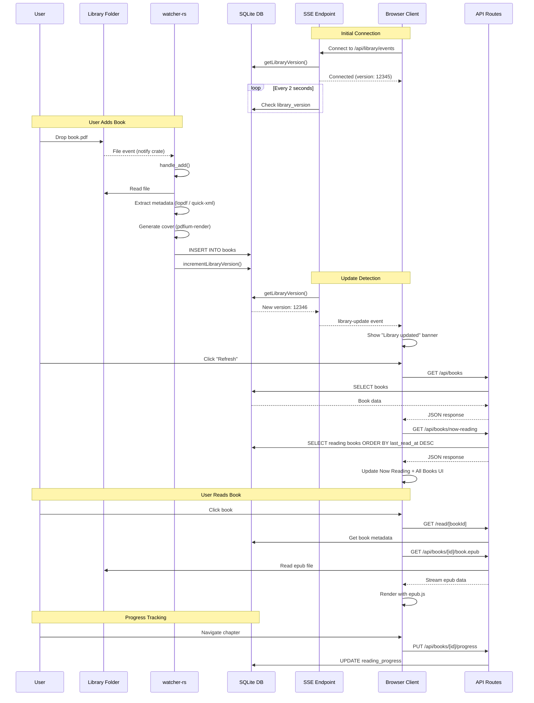
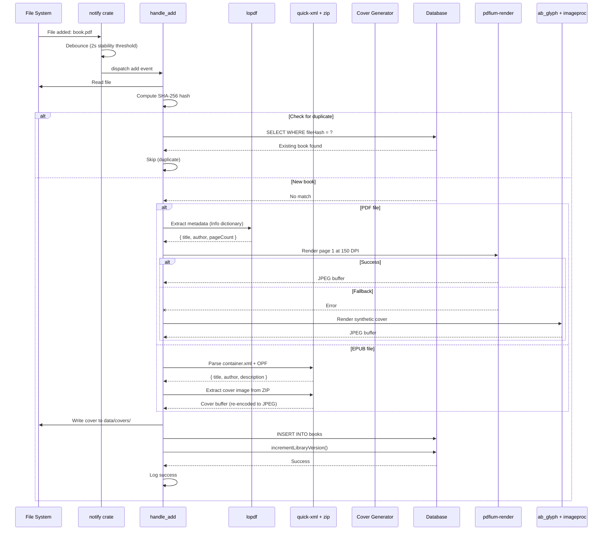
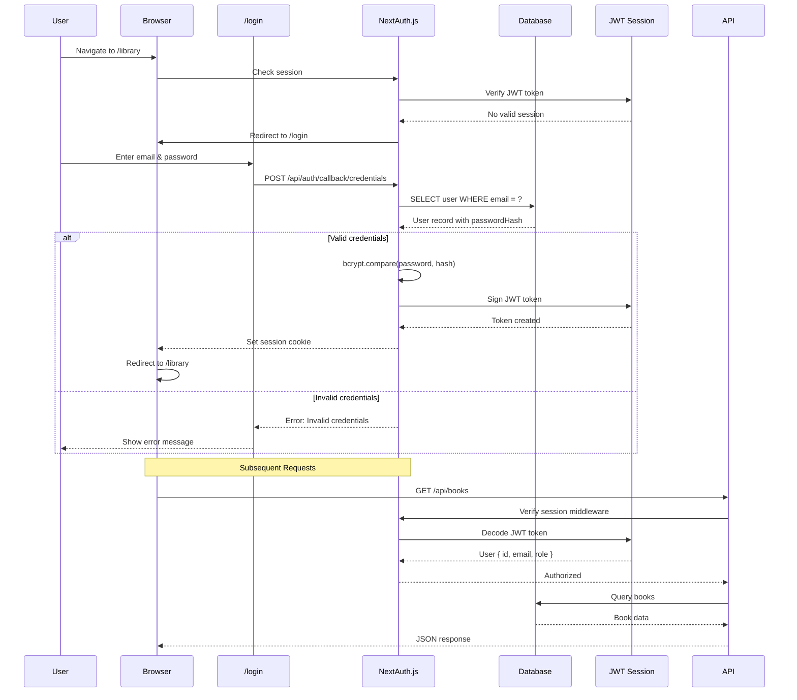
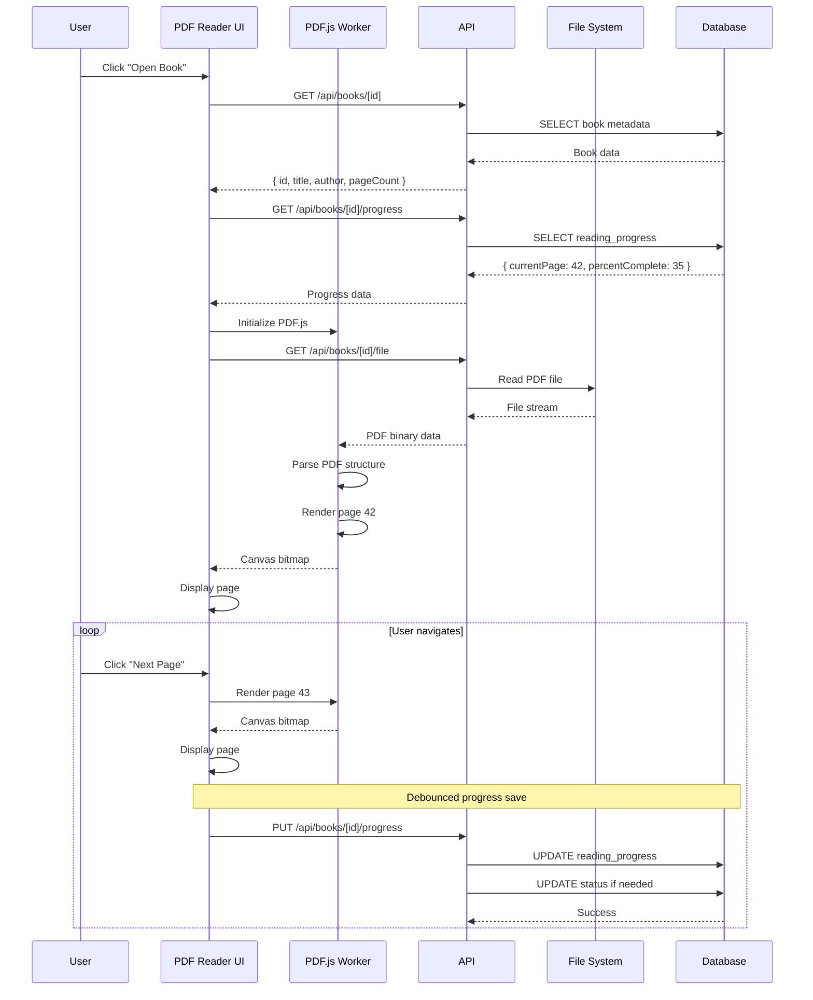
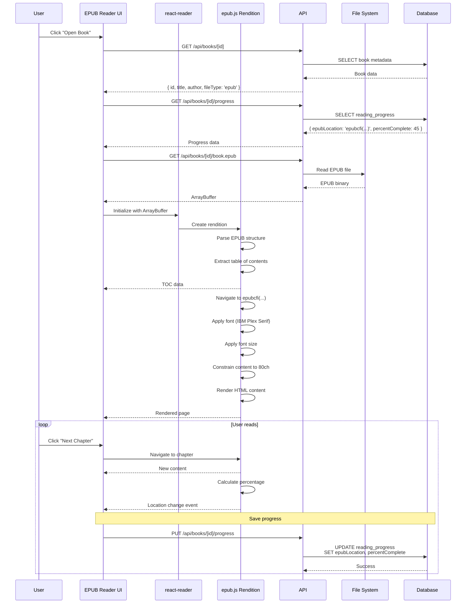
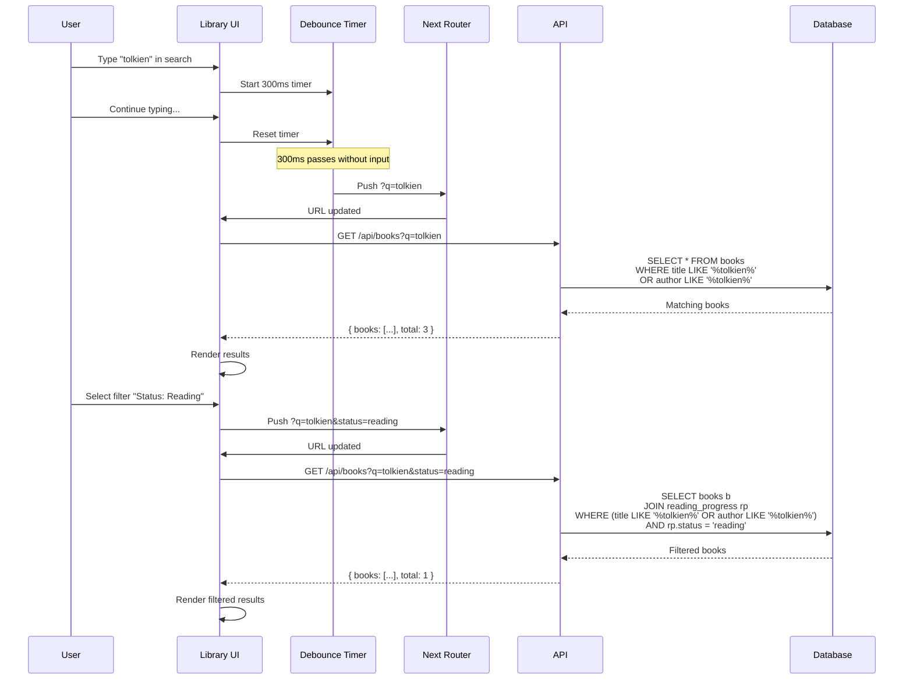
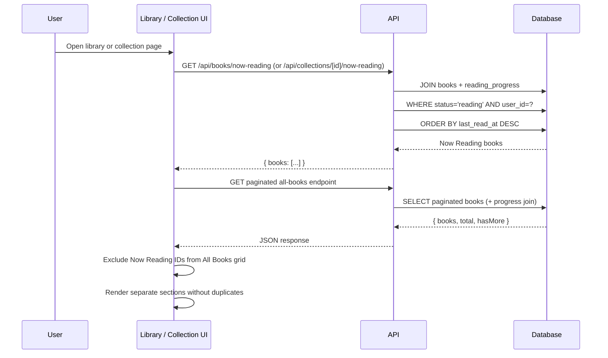
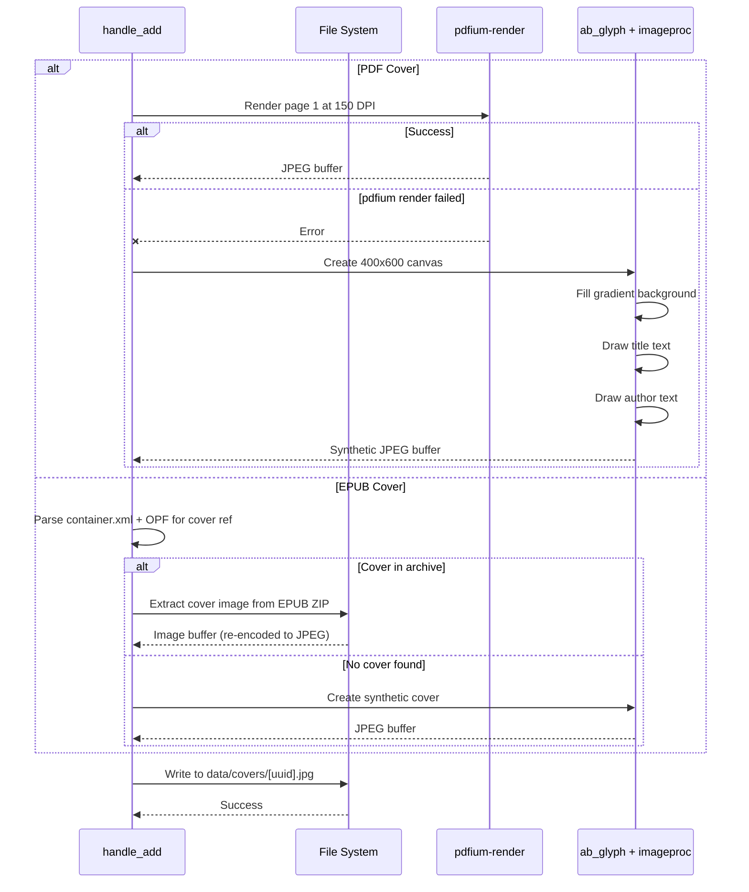
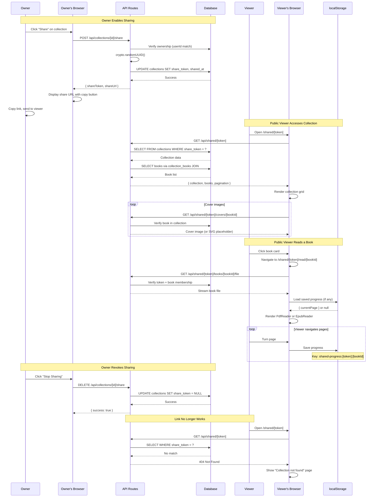
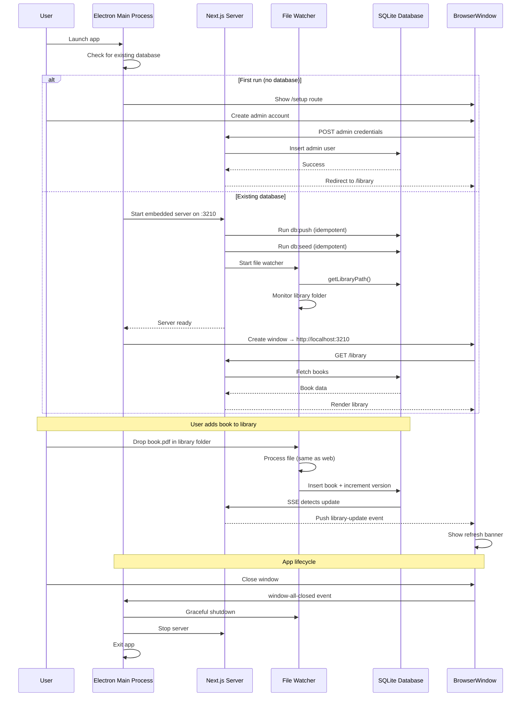

# Sequence Diagrams

This document contains sequence diagrams illustrating key workflows in the Alex library management system.

## Real-time Library Update Flow

This diagram shows how the system detects and propagates library changes in near real-time using Server-Sent Events (SSE) and database-backed signaling.

### Key Points

1. **SSE Connection**: Client establishes long-lived HTTP connection for push updates
2. **Version Polling**: Server polls database every 2 seconds (lightweight query)
3. **Cross-process Signaling**: Watcher and API share state via database
4. **Near Real-time**: Updates detected within 2 seconds, pushed immediately
5. **Efficient Updates**: Only refreshes when actual changes occur

---

## Book Ingestion Flow

Detailed flow showing how a new book is processed when added to the library folder.

### Processing Steps

1. **File Detection**: `notify` crate watches library folder
2. **Write Stabilization**: Custom debounce waits until file size is stable for 2 seconds
3. **Duplicate Check**: SHA-256 hash (via `sha2` crate) prevents duplicate entries
4. **Metadata Extraction**: `lopdf` for PDFs, `quick-xml` + `zip` for EPUBs
5. **Cover Generation**: `pdfium-render` for PDFs, ZIP extraction for EPUBs, synthetic fallback via `ab_glyph`
6. **Database Insert**: Atomic insert via `rusqlite`
7. **Version Bump**: Triggers real-time update to all clients

---

## User Authentication Flow

### Authentication Flow

1. **Session Check**: All protected routes verify JWT session
2. **Redirect**: Unauthenticated users sent to `/login`
3. **Credential Validation**: Email lookup + bcrypt password comparison
4. **JWT Creation**: Stateless session token (no database storage)
5. **Cookie Storage**: HttpOnly, secure session cookie
6. **Role-based Access**: Admin vs. user permissions enforced in middleware

---

## PDF Reading Flow

### PDF Reading Features

1. **Metadata Loading**: Title, author, page count fetched first
2. **Progress Restoration**: User returns to last read page
3. **Web Worker**: PDF.js runs in background thread (non-blocking)
4. **Streaming**: Large PDFs streamed incrementally
5. **Debounced Saves**: Progress updates batched to reduce writes
6. **Status Tracking**: Automatic status updates (not_started → reading → completed)

---

## EPUB Reading Flow

### EPUB Reading Features

1. **ArrayBuffer Loading**: Entire EPUB loaded into memory (fast navigation)
2. **CFI Locations**: ePub Canonical Fragment Identifiers for precise positioning
3. **TOC Extraction**: Table of contents parsed from EPUB manifest
4. **Typography Control**: Font size customization (IBM Plex Serif + 80ch column)
5. **Progress Meter**: Header displays precise percentage while reading
6. **Scroll Restore**: Saved scroll fraction is restored when viewport dimensions match
7. **Percentage Calculation**: epub.js generates location spine for progress tracking

---

## Search and Filter Flow

### Search Features

1. **Debounced Input**: 300ms delay prevents excessive API calls
2. **URL State**: Search and filters stored in query parameters
3. **Full-text Search**: Searches title and author fields
4. **Combined Filters**: Multiple filters applied simultaneously
5. **Pagination**: Results paginated (24 per page)
6. **User-specific**: Progress filters join with current user's reading data

---

## Now Reading Sections Flow

### Key Points

1. **Dedicated endpoints**: Now Reading data is fetched independently from the main paginated list.
2. **Stable ordering**: Uses `reading_progress.last_read_at DESC` for recency.
3. **Duplicate prevention**: Client removes Now Reading IDs from All Books before rendering.
4. **Infinite-scroll safety**: Section split avoids repeated loads caused by duplicate results.

---

## Cover Generation Flow

## Public Collection Sharing Flow

This diagram shows how a collection owner enables sharing and how a public viewer accesses the shared collection.

### Key Points

1. **Token generation**: `crypto.randomUUID()` produces 122-bit random tokens
2. **Ownership check**: Only the collection owner can enable/disable sharing
3. **Scoped access**: Every public endpoint validates that the book belongs to the shared collection
4. **No server state for viewers**: Reading progress stored in browser `localStorage`, not the database
5. **Instant revocation**: Setting `share_token = NULL` immediately invalidates all existing links
6. **Reader reuse**: Public reader uses the same `PdfReader` and `EpubReader` components as authenticated users

---

### Cover Generation Strategy

1. **Primary (PDFs)**: Render page 1 at 150 DPI via `pdfium-render` with statically linked PDFium
2. **Fallback (PDFs)**: Synthetic gradient cover with title/author via `ab_glyph` + `imageproc`
3. **Primary (EPUBs)**: Extract embedded cover image from the ZIP archive (re-encoded to JPEG if needed)
4. **Fallback (EPUBs)**: Generate synthetic cover
5. **Storage**: Covers stored as JPEG with UUID filename for uniqueness

---

## Electron Desktop App Flow

This diagram shows how the Electron desktop app initializes and manages the embedded Next.js server.

### Electron Architecture Notes

1. **Embedded Server**: Next.js runs as a child process managed by Electron
2. **Port 3210**: Fixed port for internal communication (no conflicts - local only)
3. **Single Instance**: Electron ensures only one app instance runs at a time
4. **Data Location**: SQLite database and library stored in platform-specific app data:
   - macOS: `~/Library/Application Support/alex`
   - Windows: `%APPDATA%/alex`
   - Linux: `~/.config/alex`
5. **Rust Binary**: `watcher-rs` bundled at `process.resourcesPath/watcher-rs/` with PDFium library; no native Node modules required
6. **Auto-updates**: Electron-builder provides update checking and installation
7. **First-run Setup**: Setup route creates initial admin account before library access
