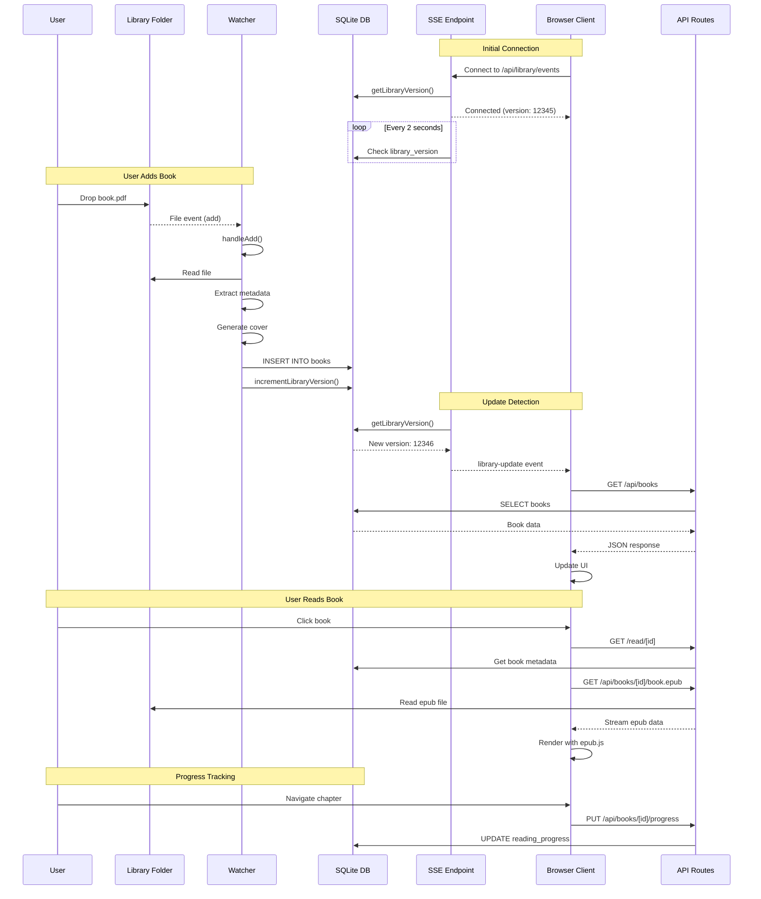
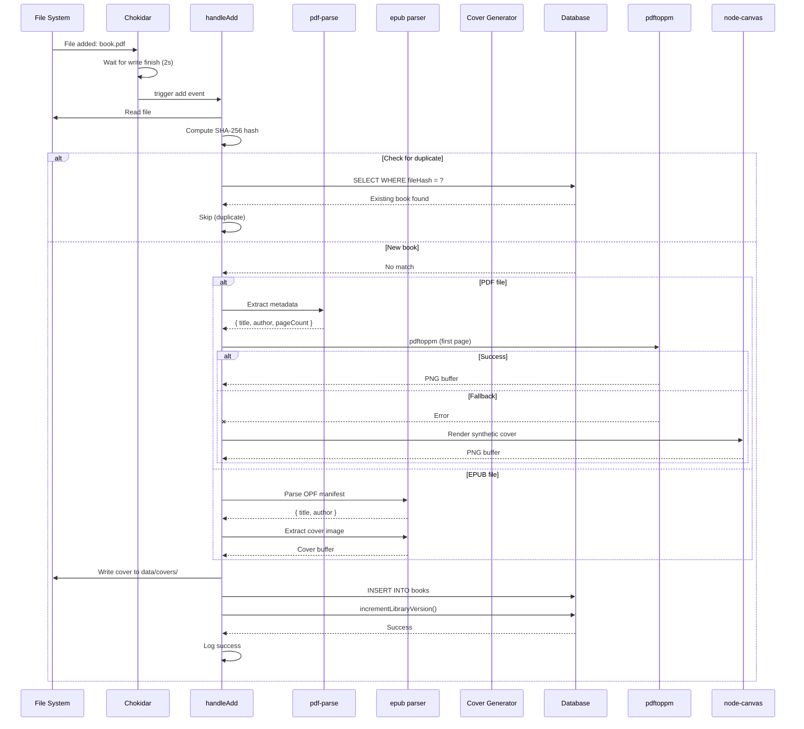
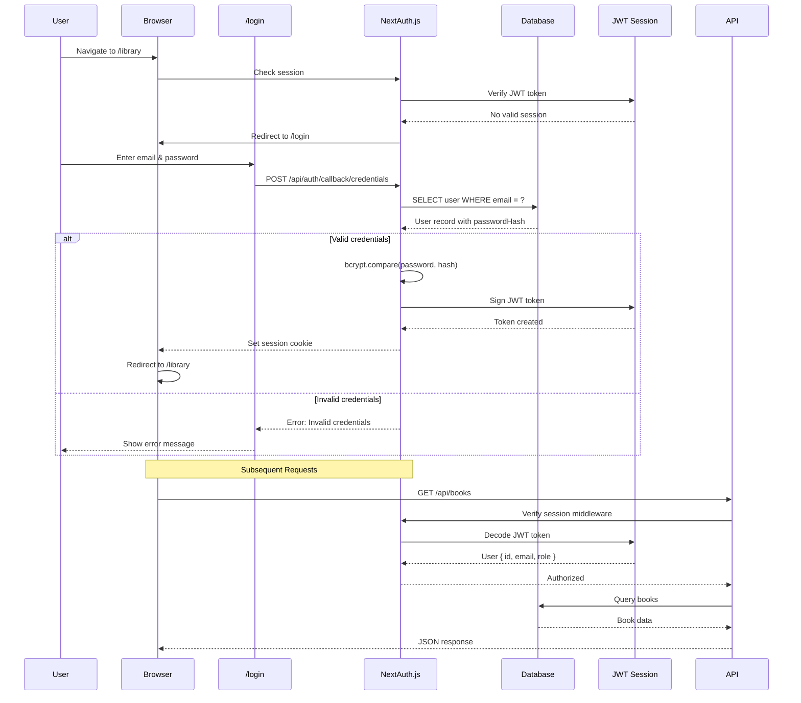
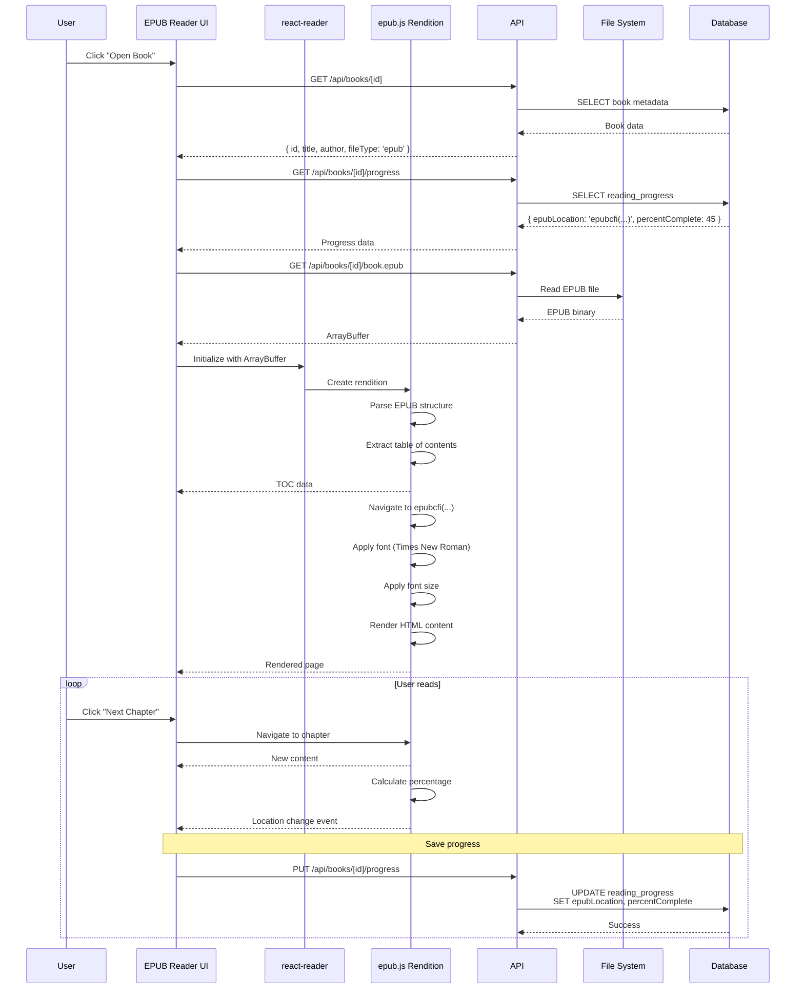
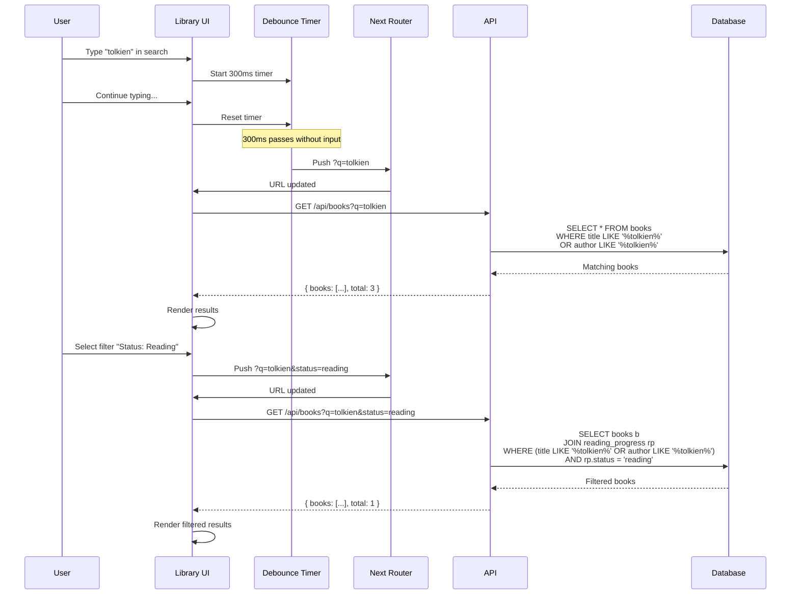
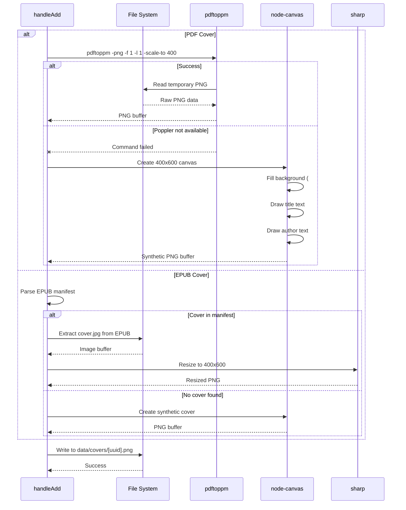

# Sequence Diagrams

This document contains sequence diagrams illustrating key workflows in the Alex library management system.

## Real-time Library Update Flow

This diagram shows how the system detects and propagates library changes in near real-time using Server-Sent Events (SSE) and database-backed signaling.

### Key Points

1. **SSE Connection**: Client establishes long-lived HTTP connection for push updates
2. **Version Polling**: Server polls database every 2 seconds (lightweight query)
3. **Cross-process Signaling**: Watcher and API share state via database
4. **Near Real-time**: Updates detected within 2 seconds, pushed immediately
5. **Efficient Updates**: Only refreshes when actual changes occur

---

## Book Ingestion Flow

Detailed flow showing how a new book is processed when added to the library folder.

### Processing Steps

1. **File Detection**: Chokidar watches library folder
2. **Write Stabilization**: Waits 2 seconds to ensure file is fully written
3. **Duplicate Check**: SHA-256 hash prevents duplicate entries
4. **Metadata Extraction**: Format-specific parsers extract title, author, etc.
5. **Cover Generation**: Primary method (pdftoppm) with canvas fallback
6. **Database Insert**: Atomic insert of book record
7. **Version Bump**: Triggers real-time update to all clients

---

## User Authentication Flow

### Authentication Flow

1. **Session Check**: All protected routes verify JWT session
2. **Redirect**: Unauthenticated users sent to `/login`
3. **Credential Validation**: Email lookup + bcrypt password comparison
4. **JWT Creation**: Stateless session token (no database storage)
5. **Cookie Storage**: HttpOnly, secure session cookie
6. **Role-based Access**: Admin vs. user permissions enforced in middleware

---

## PDF Reading Flow

### PDF Reading Features

1. **Metadata Loading**: Title, author, page count fetched first
2. **Progress Restoration**: User returns to last read page
3. **Web Worker**: PDF.js runs in background thread (non-blocking)
4. **Streaming**: Large PDFs streamed incrementally
5. **Debounced Saves**: Progress updates batched to reduce writes
6. **Status Tracking**: Automatic status updates (not_started → reading → completed)

---

## EPUB Reading Flow

### EPUB Reading Features

1. **ArrayBuffer Loading**: Entire EPUB loaded into memory (fast navigation)
2. **CFI Locations**: ePub Canonical Fragment Identifiers for precise positioning
3. **TOC Extraction**: Table of contents parsed from EPUB manifest
4. **Typography Control**: Font size customization (Times New Roman font family)
5. **Reflowable Text**: Content adapts to viewport size
6. **Percentage Calculation**: epub.js generates location spine for progress tracking

---

## Search and Filter Flow

### Search Features

1. **Debounced Input**: 300ms delay prevents excessive API calls
2. **URL State**: Search and filters stored in query parameters
3. **Full-text Search**: Searches title and author fields
4. **Combined Filters**: Multiple filters applied simultaneously
5. **Pagination**: Results paginated (20 per page)
6. **User-specific**: Progress filters join with current user's reading data

---

## Cover Generation Flow

### Cover Generation Strategy

1. **Primary (PDFs)**: Use `pdftoppm` from poppler-utils (highest quality)
2. **Fallback (PDFs)**: Synthetic cover with title/author via node-canvas
3. **Primary (EPUBs)**: Extract embedded cover from manifest
4. **Fallback (EPUBs)**: Generate synthetic cover
5. **Standardization**: All covers resized to 400x600px PNG
6. **Storage**: Covers stored with UUID filename for uniqueness
